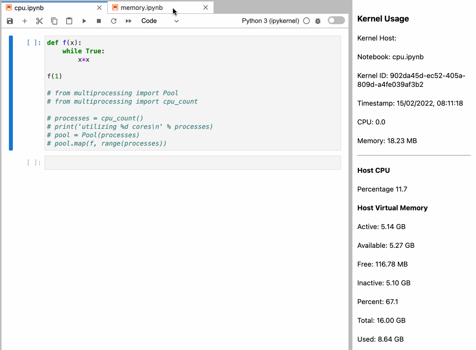

# JupyterLab Kernel Usage

[](https://github.com/quansight/jupyterlab-kernel-usage/actions/workflows/build.yml)

This is an extension for JupyterLab which allows to get kernel usage in a JupyerLab sidebar.



> For now, you will need to "bootstrap" the sidebar clicking between 2 notebooks so the values show up and refresh. Do that only the first time you make the sidebar visible.

This extension is composed of a Python package named `jupyterlab_kernel_usage` for the server extension and a NPM package named `jupyterlab-kernel-usage` for the frontend extension.

## Contributing

### Develop

Use the provided `environment.yaml` to install the conda environment.

```base
conda deactivate && \
  make env-rm && \
  make env
conda activate jupyterlab-kernel-usage
```

```python
# Install the server and frontend in dev mode.
make install-dev
```

```python
# In terminal 1, Start the jupyterlab.
# open http://localhost:8234?token=...
make jlab
```

```python
# In terminal 2, start the extension building in watch mode.
make watch
```

When making changes to the extension you will need to issue a `jupyter labextension build`, or, start `jlpm run watch` in the root of the repository to rebuild on every changes. You do not need to restart or rebuild JupyterLab for changes on the frontend extensions, but do need to restart the server for changes to the Python code.

### Development install

Note: You will need NodeJS to build the extension package.

The `jlpm` command is JupyterLab's pinned version of
[yarn](https://yarnpkg.com/) that is installed with JupyterLab. You may use
`yarn` or `npm` in lieu of `jlpm` below.

```bash
# Clone the repo to your local environment
# Change directory to the jupyterlab_kernel_usage directory
# Install package in development mode
pip install -e .
# Link your development version of the extension with JupyterLab
jupyter labextension develop . --overwrite
# Server extension must be manually installed in develop mode
jupyter server extension enable jupyterlab_kernel_usage
# Rebuild extension Typescript source after making changes
jlpm run build
```

You can watch the source directory and run JupyterLab at the same time in different terminals to watch for changes in the extension's source and automatically rebuild the extension.

```bash
# Watch the source directory in one terminal, automatically rebuilding when needed
jlpm run watch
# Run JupyterLab in another terminal
jupyter lab
```

With the watch command running, every saved change will immediately be built locally and available in your running JupyterLab. Refresh JupyterLab to load the change in your browser (you may need to wait several seconds for the extension to be rebuilt).

By default, the `jlpm run build` command generates the source maps for this extension to make it easier to debug using the browser dev tools. To also generate source maps for the JupyterLab core extensions, you can run the following command:

```bash
jupyter lab build --minimize=False
```

### Development uninstall

```bash
# Server extension must be manually disabled in develop mode
jupyter server extension disable jupyterlab_kernel_usage
pip uninstall jupyterlab_kernel_usage
```

In development mode, you will also need to remove the symlink created by `jupyter labextension develop`
command. To find its location, you can run `jupyter labextension list` to figure out where the `labextensions`
folder is located. Then you can remove the symlink named `jupyterlab_kernel_usage` within that folder.

## Requirements

* JupyterLab >= 3.0

## Install

To install the extension, execute:

```bash
pip install jupyterlab_kernel_usage
```

## Uninstall

To remove the extension, execute:

```bash
pip uninstall jupyterlab_kernel_usage
```

## Troubleshoot

If you are seeing the frontend extension, but it is not working, check
that the server extension is enabled:

```bash
jupyter server extension list
```

If the server extension is installed and enabled, but you are not seeing
the frontend extension, check the frontend extension is installed:

```bash
jupyter labextension list
```
### Packaging the extension

See [RELEASE](RELEASE.md)
