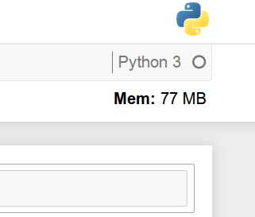
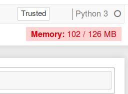

**[Installation](#installation)** |
**[Configuration](#configuration)** |
**[Resources Displayed](#resources-displayed)** |
**[Contributing](#contributing)**

# jupyter-resource-usage


[](https://mybinder.org/v2/gh/jupyter-server/jupyter-resource-usage/stable)
[](https://pypi.python.org/pypi/jupyter-resource-usage)
[](https://pypi.python.org/pypi/jupyter-resource-usage)
[](https://github.com/jupyter-server/jupyter-resource-usage/issues)



Jupyter Resource Usage is an extension for Jupyter Notebooks and JupyterLab that
displays an indication of how much resources your current notebook server and
its children (kernels, terminals, etc) are using. This is displayed in the
main toolbar in the notebook itself, refreshing every 5s.

## Installation

You can currently install this package from PyPI.

```bash
pip install jupyter-resource-usage
```

**If your notebook version is < 5.3**, you need to enable the extension manually.

```
jupyter serverextension enable --py jupyter-resource-usage --sys-prefix
jupyter nbextension install --py jupyter-resource-usage --sys-prefix
jupyter nbextension enable --py jupyter-resource-usage --sys-prefix
```

## Configuration

### Memory Limit

`jupyter-resource-usage` can display a memory limit (but not enforce it). You can set this
in several ways:

1. `MEM_LIMIT` environment variable. This is set by [JupyterHub](https://github.com/jupyterhub/jupyterhub/)
   if using a spawner that supports it.
2. In the commandline when starting `jupyter notebook`, as `--ResourceUseDisplay.mem_limit`.
3. In your Jupyter notebook [traitlets](https://traitlets.readthedocs.io/en/stable/) config file

The limit needs to be set as an integer in Bytes.

### Memory usage warning threshold



The background of the resource display can be changed to red when the user is near a memory limit.
The threshold for this warning can be configured as a fraction of the memory limit.

If you want to flash the warning to the user when they are within 10% of the memory limit, you
can set the parameter `--ResourceUseDisplay.mem_warning_threshold=0.1`.


### CPU Usage

`jupyter-resource-usage` can also track CPU usage and report a `cpu_percent` value as part of the `/api/metrics/v1` response.

You can set the `cpu_limit` in several ways:

1. `CPU_LIMIT` environment variable. This is set by [JupyterHub](https://github.com/jupyterhub/jupyterhub/)
   if using a spawner that supports it.
2. In the command line when starting `jupyter notebook`, as `--ResourceUseDisplay.cpu_limit`.
3. In your Jupyter notebook [traitlets](https://traitlets.readthedocs.io/en/stable/) config file

The limit corresponds to the number of cpus the user has access to, but does not enforce it.

Additionally, you can set the `track_cpu_percent` trait to enable CPU usage tracking (disabled by default):

```python
c = get_config()
c.NotebookApp.ResourceUseDisplay.track_cpu_percent = True
```

As a command line argument:

```bash
jupyter notebook --ResourceUseDisplay.track_cpu_percent=True
```

## Resources Displayed

Currently the server extension only reports memory usage (just RSS) and CPU usage. Other metrics will be
added in the future as needed.

The notebook extension currently doesn't show CPU usage, only memory usage.

## Contributing

If you would like to contribute to the project, please read the [`CONTRIBUTING.md`](CONTRIBUTING.md). The `CONTRIBUTING.md` file
explains how to set up a development installation and how to run the test suite.
