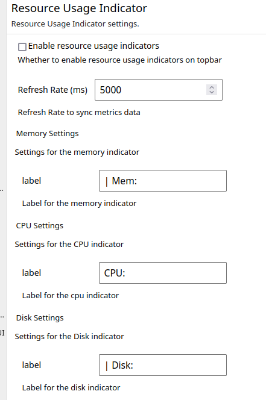

**[Installation](#installation)** |
**[Configuration](#configuration)** |
**[Resources Displayed](#resources-displayed)** |
**[Contributing](#contributing)**

# jupyter-resource-usage


[](https://mybinder.org/v2/gh/jupyter-server/jupyter-resource-usage/main)
[](https://pypi.python.org/pypi/jupyter-resource-usage)
[](https://anaconda.org/conda-forge/jupyter-resource-usage)
[](https://pypi.python.org/pypi/jupyter-resource-usage)
[](https://github.com/jupyter-server/jupyter-resource-usage/issues)


Jupyter Resource Usage is an extension for Jupyter Notebooks and JupyterLab that
displays an indication of how much resources your current notebook server and
its children (kernels, terminals, etc) are using. This is displayed in the
status bar in the JupyterLab and notebook, refreshing every 5s.

Kernel resource usage can be displayed in a sidebar for IPython kernels with
[ipykernel](https://github.com/ipython/ipykernel) >= 6.11.0.


The kernel usage is available for Notebook 7.x too which can be enabled at
`View -> Right Sidebar -> Show Kernel Usage`. In the case of JupyterLab interface, it is
enough to click `tachometer` icon on the right sidebar.

The package provides an alternative frontend for the `jupyter-resource-usage` metrics:


Previously, this extension used to be distributed with
[jupyterlab-system-monitor](https://github.com/jtpio/jupyterlab-system-monitor) package.
Starting from `1.0.0`, the alternative frontend has been integrated into the
current repository. Check [Alternative frontend](#enable-alternative-frontend) section
on how to enable and configure this alternative frontend.

**Note** that for JupyterLab 3.x and 2.x, users should install the alternative frontend
from [jupyterlab-system-monitor](https://github.com/jtpio/jupyterlab-system-monitor).

## Installation

### JupyterLab 4.x and Notebook 7.x

You should install the latest version `>=1.0.0` for JupyterLab 4 compatability.

```bash
pip install jupyter-resource-usage
```

Or with `conda`:

```bash
conda install -c conda-forge jupyter-resource-usage
```

### JupyterLab 3.x and Notebook 6.x

You should pin the versions to `<1.0.0`

```bash
pip install 'jupyter-resource-usage<1.0.0'
```

Or with `conda`:

```bash
conda install -c conda-forge 'jupyter-resource-usage<1.0.0'
```

**If your notebook version is < 5.3**, you need to enable the extension manually.

```
jupyter serverextension enable --py jupyter_resource_usage --sys-prefix
jupyter nbextension install --py jupyter_resource_usage --sys-prefix
jupyter nbextension enable --py jupyter_resource_usage --sys-prefix
```

## Configuration

### Memory Limit

`jupyter-resource-usage` can display a memory limit (but not enforce it). You can set this
in several ways:

1. `MEM_LIMIT` environment variable. This is set by [JupyterHub](https://github.com/jupyterhub/jupyterhub/)
   if using a spawner that supports it.
2. In the commandline when starting `jupyter notebook`, as `--ResourceUseDisplay.mem_limit`.
3. In your Jupyter notebook [traitlets](https://traitlets.readthedocs.io/en/stable/) config file

The limit needs to be set as an integer in Bytes.

### Memory usage warning threshold


The background of the resource display can be changed to red when the user is near a memory limit.
The threshold for this warning can be configured as a fraction of the memory limit.

If you want to flash the warning to the user when they are within 10% of the memory limit, you
can set the parameter `--ResourceUseDisplay.mem_warning_threshold=0.1`.

### CPU Usage

`jupyter-resource-usage` can also track CPU usage and report a `cpu_percent` value as part of the `/api/metrics/v1` response.

You can set the `cpu_limit` in several ways:

1. `CPU_LIMIT` environment variable. This is set by [JupyterHub](https://github.com/jupyterhub/jupyterhub/)
   if using a spawner that supports it.
2. In the command line when starting `jupyter notebook`, as `--ResourceUseDisplay.cpu_limit`.
3. In your Jupyter notebook [traitlets](https://traitlets.readthedocs.io/en/stable/) config file

The limit corresponds to the number of cpus the user has access to, but does not enforce it.

Additionally, you can set the `track_cpu_percent` trait to enable CPU usage tracking (disabled by default):

```python
c = get_config()
c.ResourceUseDisplay.track_cpu_percent = True
```

As a command line argument:

```bash
jupyter notebook --ResourceUseDisplay.track_cpu_percent=True
```

When `track_cpu_percent` is set to `True`, status will report CPU utilisation along with
memory:


### Disable Prometheus Metrics

There is a [known bug](https://github.com/jupyter-server/jupyter-resource-usage/issues/123) with Prometheus metrics which
causes "lag"/pauses in the UI. To workaround this you can disable Prometheus metric reporting using:

```
--ResourceUseDisplay.enable_prometheus_metrics=False
```

## Enable alternative frontend

By default, the alternative frontend is disabled. To enable it, users should go to
`Settings -> Settings Editor -> Resource Usage Indicator` which will render following
form



By checking "Enable resource usage indicators" and refreshing the browser tab will
render the alternative frontend in the topbar.

Users can change the label and refresh rate for the alternative frontend using settings
editor.

## Resources Displayed

Currently the server extension only reports memory usage and CPU usage. Other metrics will be added in the future as needed.

Memory usage will show the PSS whenever possible (Linux only feature), and default to RSS otherwise.

The notebook extension currently doesn't show CPU usage, only memory usage.

## Contributing

If you would like to contribute to the project, please read the [`CONTRIBUTING.md`](CONTRIBUTING.md). The `CONTRIBUTING.md` file
explains how to set up a development installation and how to run the test suite.
